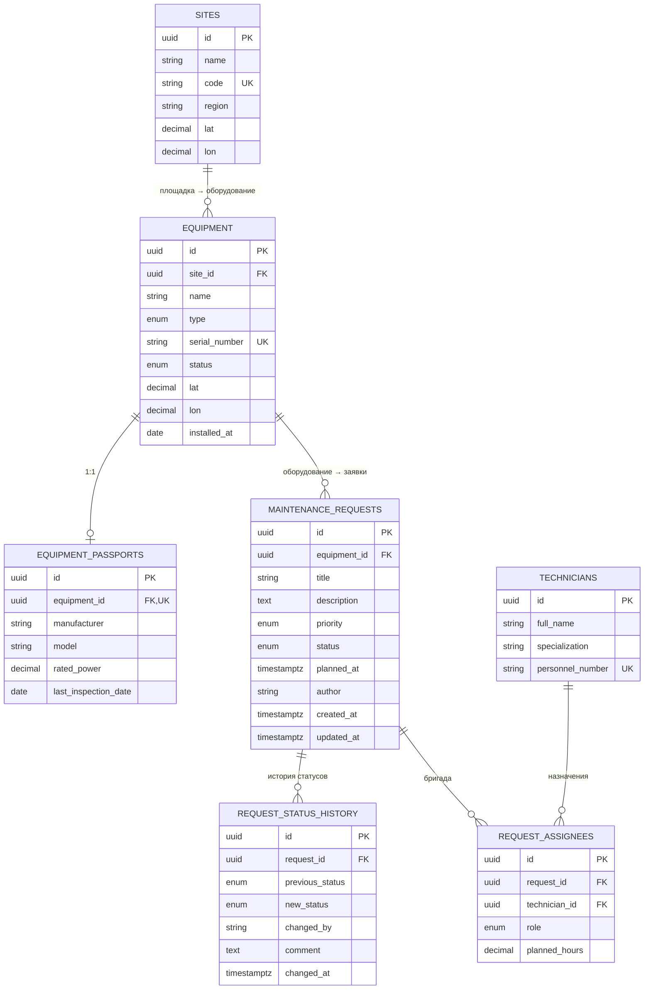

# Equipment Maintenance Tickets API

REST API для учёта оборудования производственной площадки (например, ветропарка) и заявок на его техническое обслуживание. Сервис контролирует жизненный цикл заявки и позволяет оценить погодные условия на объекте перед планированием наружных работ.

Данные хранятся в PostgreSQL (Sequelize, миграции и сиды — в `src/db`). Доступ к данным выполняется только через слой репозитория, поэтому переход с файлового хранилища на БД не затронул контроллеры и сервисы.

## Требования к окружению

- Node.js 24 LTS (см. [.nvmrc](.nvmrc))
- npm (устанавливается вместе с Node.js)

## Установка и запуск

```bash
  npm install
  cp .env.example .env
  docker compose up -d
  npm run db:migrate
  npm run db:seed:all
  npm run dev
```

Сервис поднимется на `http://localhost:3000` (порт настраивается через `PORT`). Переменные окружения загружаются нативным флагом Node.js `--env-file-if-exists` (см. `package.json`) — отдельная зависимость вроде `dotenv` не нужна. Если файла `.env` нет, сервис возьмёт значения по умолчанию из [src/config/env.js](src/config/env.js) или переменные окружения, заданные снаружи (актуально для production).

Команда `npm start` запускает сервис без автоперезапуска при изменении файлов — для этого используется `npm run dev`.

`docker compose up -d` поднимает PostgreSQL с именованным томом и healthcheck (см. [docker-compose.yml](docker-compose.yml)). Если БД недоступна при старте сервиса, он не падает молча — печатает понятную ошибку и завершает процесс (код выхода 1), вместо того чтобы принимать запросы без рабочего хранилища.

`npm run db:migrate` создаёт схему, `npm run db:seed:all` наполняет её демонстрационными данными: 2 площадки, 8 единиц оборудования (у части нет паспорта — специально, чтобы видеть оба варианта в ответе), 6 паспортов, 6 специалистов, 24 заявки во всех четырёх статусах с историей переходов и назначенными бригадами — этого достаточно, чтобы сразу проверить оба отчёта и все связи. Подробнее о миграциях — в разделе [Миграции и сиды](#миграции-и-сиды).

## Переменные окружения

| Переменная             | Назначение                                                 | Значение по умолчанию                    |
| ---------------------- | ---------------------------------------------------------- | ---------------------------------------- |
| `PORT`                 | порт HTTP-сервера                                          | `3000`                                   |
| `NODE_ENV`             | режим работы: `development` \| `production` \| `test`      | `development`                            |
| `CORS_ORIGINS`         | список разрешённых origin для CORS через запятую           | пусто                                    |
| `RATE_LIMIT_WINDOW_MS` | окно ограничения частоты запросов, мс                      | `60000`                                  |
| `RATE_LIMIT_MAX`       | максимум запросов на IP в окне                             | `100`                                    |
| `WEATHER_API_URL`      | базовый URL внешнего погодного API (Open-Meteo, без ключа) | `https://api.open-meteo.com/v1/forecast` |
| `REQUEST_TIMEOUT_MS`   | таймаут запросов к внешним сервисам, мс                    | `5000`                                   |
| `DB_HOST`              | хост PostgreSQL                                            | `localhost`                              |
| `DB_PORT`              | порт PostgreSQL                                            | `5432`                                   |
| `DB_NAME`              | имя базы данных                                            | `equipment_tickets`                      |
| `DB_USER`              | пользователь БД                                            | `postgres`                               |
| `DB_PASSWORD`          | пароль БД                                                  | `postgres`                               |
| `DB_POOL_MIN`          | минимальный размер пула соединений Sequelize               | `0`                                      |
| `DB_POOL_MAX`          | максимальный размер пула соединений Sequelize              | `5`                                      |

Полный список с комментариями — в [.env.example](.env.example). Значения по умолчанию для `DB_*` рассчитаны на локальный `docker-compose.yml` и не годятся для продакшена.

## Структура проекта

```text
  src/
    app.js            сборка Express-приложения (без запуска сервера)
    server.js         точка входа: чтение конфигурации и запуск HTTP-сервера
    config/           конфигурация (переменные окружения, логгер)
    routes/           маршруты, сгруппированные по ресурсам
    controllers/       разбор HTTP-запроса и формирование ответа
    services/          бизнес-логика
    repositories/       доступ к данным
    middlewares/       request-id, логирование, валидация, обработка ошибок
    validators/         схемы валидации запросов
    errors/             типы ошибок приложения
    db/
      models/           модели Sequelize и ассоциации (index.js)
      migrations/        схема БД, по одной сущности на файл
      seeders/            демонстрационные данные
      config.cjs           конфигурация sequelize-cli
      import-legacy-data.js  перенос data/*.json из Кейса 2 в БД
  docs/postman/         экспортированная коллекция Postman
```

`app.js` не запускает сервер — модуль `createApp()` можно подключать в тестах (Jest + Supertest) без поднятия реального порта.

## Схема базы данных



Семь таблиц, приведены к третьей нормальной форме: справочные сущности (площадки, специалисты) вынесены отдельно от того, что на них ссылается, повторяющихся групп полей нет, каждый неключевой атрибут зависит только от первичного ключа своей таблицы.

Правила удаления (`ON DELETE`) выбраны осознанно, не оставлены по умолчанию:

| Связь                                          | Правило    | Почему                                                                                                                          |
| ----------------------------------------------- | ---------- | -------------------------------------------------------------------------------------------------------------------------------- |
| `equipment.site_id → sites.id`                  | `RESTRICT` | площадку с оборудованием не удалить — сначала перенести или удалить оборудование                                                |
| `equipment_passports.equipment_id → equipment.id` | `CASCADE`  | паспорт бессмысленен без оборудования, к которому относится                                                                     |
| `maintenance_requests.equipment_id → equipment.id` | `RESTRICT` | оборудование с историей заявок не удаляется, даже если все заявки уже закрыты, — иначе теряется история обслуживания            |
| `request_status_history.request_id → maintenance_requests.id` | `CASCADE`  | запись истории не имеет смысла без заявки; сами записи истории не редактируются и не удаляются по отдельности                   |
| `request_assignees.request_id → maintenance_requests.id` | `CASCADE`  | назначение бессмысленно без заявки                                                                                              |
| `request_assignees.technician_id → technicians.id` | `RESTRICT` | специалиста с активными или прошлыми назначениями не удалить                                                                    |

`(request_id, technician_id)` в `request_assignees` уникальна на уровне БД — один специалист не может быть назначен на одну заявку дважды.

Правило `RESTRICT` на `maintenance_requests.equipment_id` строже бизнес-правила "нельзя удалить оборудование с незакрытыми заявками" (`new`/`in_progress`): сервис проверяет именно это и отвечает понятным `409`, а ограничение внешнего ключа — вторая линия защиты на случай оборудования с историей только закрытых заявок, где терять данные обслуживания тоже не хочется.

Два места, где решение сознательно отступает от буквального перечня полей в задании:

- у `equipment` есть собственные `lat`/`lon` в дополнение к координатам площадки. Это не дублирование: площадка описывает территорию, координаты оборудования — точное размещение конкретной единицы на ней. Заодно это сохраняет формат ответа `GET /api/equipment/:id`, на котором завязан `.../weather`, — при переносе на PostgreSQL внешний контракт не должен был измениться.
- `maintenance_requests.author` необязателен. В проекте нет аутентификации, а обязательное поле сломало бы старые запросы на создание заявки из коллекции Кейса 2.

## Миграции и сиды

Схема создаётся только миграциями (`sequelize-cli`); `sequelize.sync({ force: true })` или ручное создание таблиц не используются. Миграции лежат в [src/db/migrations](src/db/migrations), сиды — в [src/db/seeders](src/db/seeders), порядок применения в обоих случаях — по имени файла (временная метка в начале). Таблицы создаются в порядке зависимостей: `sites → equipment → equipment_passports → technicians → maintenance_requests → request_status_history → request_assignees`.

```bash
  npm run db:migrate          # применить все миграции
  npm run db:migrate:undo     # откатить последнюю
  npm run db:migrate:undo:all # откатить все миграции
  npm run db:seed:all         # наполнить демонстрационными данными
  npm run db:seed:undo:all    # удалить демонстрационные данные
  npm run db:import-legacy    # перенести data/equipment.json и data/requests.json из Кейса 2, если они есть
```

У каждой миграции рабочий откат: помимо `DROP TABLE`, он ещё и удаляет Postgres-типы `ENUM`, которые сама же миграция создала при накате, — без этого повторный `db:migrate` после отката падает с ошибкой "type already exists". Цикл «применить всё → откатить всё → применить снова» проверен на реальном Postgres и проходит без ошибок.

`src/db/config.cjs` и [.sequelizerc](.sequelizerc) — файлы с расширением `.cjs`, а не `.js`: в `package.json` стоит `"type": "module"`, а `sequelize-cli` загружает конфиг через `require()`, которому нужен явно CommonJS-файл.

## Модель данных

### Оборудование (equipment)

| Поле           | Тип                                                           | Комментарий                          |
| -------------- | ------------------------------------------------------------- | ------------------------------------- |
| `id`           | string (uuid)                                                 | генерируется сервером                |
| `siteId`       | string (uuid)                                                 | ссылка на площадку, обязательное      |
| `name`         | string, 3–100 символов                                        | обязательное                         |
| `type`         | `turbine` \| `inverter` \| `sensor` \| `substation`           |                                       |
| `serialNumber` | string                                                        | уникален в пределах системы          |
| `location`     | `{ lat: number, lon: number }`                                |                                       |
| `status`       | `operational` \| `maintenance` \| `fault` \| `decommissioned` |                                       |
| `installedAt`  | ISO-дата                                                      | не в будущем                         |
| `passport`     | `{ manufacturer, model, ratedPower, lastInspectionDate } \| null` | паспорт оборудования, если заведён |

Площадка (`GET /api/sites`) и специалист (`GET /api/technicians`) — простые справочники, отдаются списком без пагинации: `{ id, name, code, region, location }` и `{ id, fullName, specialization, personnelNumber }` соответственно. Отдельных эндпоинтов на создание/изменение у них нет — заполняются сидами.

### Заявка на обслуживание (maintenance request)

| Поле                      | Тип                                            | Комментарий                                |
| ------------------------- | ---------------------------------------------- | ------------------------------------------ |
| `id`                      | string (uuid)                                  | генерируется сервером                      |
| `equipmentId`             | string (uuid)                                  | ссылка на существующее оборудование        |
| `title`                   | string, 5–120 символов                         | обязательное                               |
| `description`             | string, до 2000 символов                       | необязательное                             |
| `priority`                | `low` \| `medium` \| `high` \| `critical`      |                                            |
| `status`                  | `new` \| `in_progress` \| `done` \| `rejected` | по умолчанию `new`, проставляется сервером |
| `plannedAt`               | ISO-дата-время                                 | необязательное                             |
| `author`                  | string, до 150 символов                        | необязательное, кто завёл заявку           |
| `assignees`               | `Array<{ technicianId, fullName, role, plannedHours }>` | назначенная бригада, `role` — `lead` \| `member` |
| `createdAt` / `updatedAt` | ISO-дата-время                                 | проставляются сервером                     |

### Переходы статуса заявки

```text
  new → in_progress → done
  new → rejected
  in_progress → rejected
```

Из `done` и `rejected` переходы запрещены. Попытка недопустимого перехода — `409 CONFLICT`. Смена статуса выполняется только через `PATCH /api/requests/:id/status`; в общем `PATCH /api/requests/:id` поле `status` игнорируется, как и `id`/`createdAt`/`updatedAt`. Перевод в `in_progress` без назначенной бригады — тоже `409`.

Смена статуса и запись в историю выполняются одной транзакцией с блокировкой строки заявки (`SELECT ... FOR UPDATE`): при ошибке откатывается всё, а при одновременных запросах к одной заявке второй дожидается первого и заново проверяет условие перехода по уже актуальному статусу.

### История статуса заявки

`GET /api/requests/:id/history` возвращает список переходов в хронологическом порядке. Запись не создаётся при создании заявки (там нет перехода, статус сразу `new`) — только на реальных сменах статуса.

| Поле                            | Тип                     | Комментарий               |
| -------------------------------- | ------------------------ | -------------------------- |
| `id`                              | string (uuid)             |                            |
| `requestId`                       | string (uuid)             |                            |
| `previousStatus` / `newStatus`    | статус заявки             |                            |
| `changedBy`                       | string \| null            | необязательное поле `PATCH .../status` |
| `comment`                         | string \| null            | необязательное поле `PATCH .../status` |
| `changedAt`                       | ISO-дата-время            |                            |

### Назначение бригады

`POST /api/requests/:id/assignees` заменяет бригаду целиком: снимает прежний состав и добавляет новый — одной транзакцией. Тело:

```json
  { "assignees": [
    { "technicianId": "...", "role": "lead", "plannedHours": 8 },
    { "technicianId": "...", "role": "member", "plannedHours": 4 }
  ] }
```

Требование — ровно один `lead` в списке, иначе `422` и откат без изменений. Несуществующий специалист — `404`. Повтор одного `technicianId` в списке — `409` (уникальность пары «заявка — специалист» на уровне БД). `DELETE /api/requests/:id/assignees/:userId` снимает одного специалиста; если он не был назначен — `404`.

## Эндпоинты

| Метод  | Путь                          | Назначение                                                             |
| ------ | ----------------------------- | ---------------------------------------------------------------------- |
| GET    | `/api/health`                 | проверка доступности сервиса                                           |
| GET    | `/api/equipment`              | список оборудования: фильтры (`type`, `status`), сортировка, пагинация |
| POST   | `/api/equipment`              | создание единицы оборудования                                          |
| GET    | `/api/equipment/:id`          | карточка оборудования                                                  |
| PATCH  | `/api/equipment/:id`          | частичное обновление                                                   |
| DELETE | `/api/equipment/:id`          | удаление                                                               |
| GET    | `/api/equipment/:id/weather`  | прогноз погоды по координатам и пригодность окна для наружных работ    |
| GET    | `/api/equipment/:id/requests` | заявки по конкретной единице оборудования                              |
| GET    | `/api/requests`               | список заявок: фильтры, сортировка, пагинация                          |
| POST   | `/api/requests`               | создание заявки                                                        |
| GET    | `/api/requests/:id`           | карточка заявки                                                        |
| PATCH  | `/api/requests/:id`           | редактирование полей заявки (кроме статуса)                            |
| PATCH  | `/api/requests/:id/status`    | смена статуса с проверкой допустимости перехода                        |
| DELETE | `/api/requests/:id`           | удаление заявки                                                        |
| GET    | `/api/requests/:id/history`   | история изменений статуса заявки                                       |
| POST   | `/api/requests/:id/assignees` | назначение бригады на заявку                                           |
| DELETE | `/api/requests/:id/assignees/:userId` | снятие специалиста с заявки                                    |
| GET    | `/api/sites`                  | список площадок                                                        |
| GET    | `/api/sites/:id/summary`      | сводка по площадке: заявки по статусам и приоритетам, среднее время закрытия |
| GET    | `/api/technicians`            | список специалистов                                                    |
| GET    | `/api/reports/equipment-load` | нагрузка на оборудование: число заявок, трудозатраты, дата последнего обслуживания |

Удаление оборудования запрещено (`409`), пока по нему остаются заявки в статусе `new` или `in_progress` — а если по нему вообще есть заявки (в том числе только закрытые), удаление заблокирует уже внешний ключ, тоже `409`: см. [Схема базы данных](#схема-базы-данных).

### Список: фильтры, сортировка, пагинация

`GET /api/equipment` принимает query-параметры:

- `type`, `status` — фильтры по точному совпадению;
- `sort` — `name` \| `installedAt` \| `status` \| `type` (по умолчанию `installedAt`);
- `order` — `asc` \| `desc` (по умолчанию `asc`);
- `page`, `limit` — пагинация (по умолчанию `1` и `20`, максимум `limit` — `100`, максимум `page` — `10000`).

Некорректные значения (например, `page=0`, `page=100000` или неизвестный `type`) отклоняются с кодом `422`. Поля `sort` и допустимые значения фильтров — фиксированный список (`zod enum`), значение из query-строки никогда не попадает в `ORDER BY` или `WHERE` напрямую.

`GET /api/requests` принимает `status`, `priority`, `equipmentId`, `createdFrom`/`createdTo` (диапазон по `createdAt`), `sort` (`createdAt` \| `updatedAt` \| `priority` \| `plannedAt` \| `status`, по умолчанию `createdAt`), `order` (по умолчанию `desc`), `page`, `limit`. `GET /api/equipment/:id/requests` — те же фильтры/сортировка/пагинация, кроме `equipmentId` (он уже задан путём).

`GET /api/reports/equipment-load` принимает `createdFrom`/`createdTo` (период по дате создания заявки) и `minRequests` (минимум заявок у единицы оборудования, по умолчанию `0` — попадают все, включая простаивающее оборудование без единой заявки за период); без пагинации, строк не больше, чем единиц оборудования.

## Формат ответа

Успешный ответ с одним объектом:

```json
  { "data": { "id": "6b0df916-...", "name": "Турбина №1", "...": "..." } }
```

Успешный ответ со списком:

```json
  { "data": [{ "...": "..." }], "meta": { "total": 42, "page": 1, "limit": 20 } }
```

Ответ об ошибке — единый формат для всего API:

```json
  {
   "error": {
    "code": "VALIDATION_ERROR",
    "message": "Некорректные данные запроса",
    "details": [
     { "field": "name", "message": "Минимум 3 символа" },
     { "field": "type", "message": "Недопустимый тип оборудования" }
    ],
    "requestId": "b1f2c3d4-..."
   }
  }
```

`requestId` присутствует в каждом ответе об ошибке и дублируется в заголовке `X-Request-Id` — по нему запрос можно найти в логах сервиса. `details` добавляется только там, где есть что перечислить (ошибки валидации, конфликты); для остальных ошибок присутствуют только `code`, `message` и `requestId`. Все сообщения валидации — на русском языке, включая проверки типов, диапазонов и обязательности полей.

`PATCH /api/equipment/:id` и `PATCH /api/requests/:id` отклоняют пустое тело (`{}`) с кодом `422` — нужно передать хотя бы одно поле для обновления; если ни одно поле не изменилось, отправлять запрос незачем.

### Примеры запросов

Создание оборудования (`siteId` берётся из `GET /api/sites`):

```bash
  curl -X POST localhost:3000/api/equipment \
    -H "Content-Type: application/json" \
    -d '{"siteId":"be909c99-a34c-4acf-9abc-70663eb27f8d","name":"Турбина №1","type":"turbine","serialNumber":"SN-001","location":{"lat":55.75,"lon":37.62},"status":"operational","installedAt":"2023-05-01"}'
```

```json
  HTTP/1.1 201 Created
  Location: /api/equipment/6b0df916-a189-422d-9353-9e9c38374491

  { "data": { "id": "6b0df916-a189-422d-9353-9e9c38374491", "siteId": "be909c99-a34c-4acf-9abc-70663eb27f8d", "name": "Турбина №1", "type": "turbine", "serialNumber": "SN-001", "location": { "lat": 55.75, "lon": 37.62 }, "status": "operational", "installedAt": "2023-05-01", "passport": null } }
```

Попытка недопустимого перехода статуса заявки (`new → done`, минуя `in_progress`):

```bash
  curl -X PATCH localhost:3000/api/requests/{id}/status \
    -H "Content-Type: application/json" -d '{"status":"done"}'
```

```json
  HTTP/1.1 409 Conflict

  { "error": { "code": "CONFLICT", "message": "Недопустимый переход статуса: new -> done", "requestId": "..." } }
```

Назначение бригады без ведущего специалиста:

```bash
  curl -X POST localhost:3000/api/requests/{id}/assignees \
    -H "Content-Type: application/json" \
    -d '{"assignees":[{"technicianId":"...","role":"member","plannedHours":4}]}'
```

```json
  HTTP/1.1 422 Unprocessable Content

  { "error": { "code": "VALIDATION_ERROR", "message": "В бригаде должен быть ровно один специалист с ролью lead", "requestId": "..." } }
```

Сводка по площадке:

```json
  HTTP/1.1 200 OK

  {
    "data": {
      "siteId": "be909c99-a34c-4acf-9abc-70663eb27f8d",
      "requestsByStatus": { "new": 3, "in_progress": 3, "done": 4, "rejected": 2 },
      "requestsByPriority": { "low": 6, "medium": 3, "high": 3, "critical": 0 },
      "averageClosingTimeHours": 152
    }
  }
```

Нагрузка на оборудование (`GET /api/reports/equipment-load?minRequests=1`):

```json
  HTTP/1.1 200 OK

  { "data": [
    { "equipmentId": "...", "equipmentName": "Турбина №1", "requestsCount": 3, "closedRequestsCount": 2, "totalPlannedHours": 12, "lastMaintenanceAt": "2026-09-23T11:16:21.654Z" }
  ] }
```

### Коды ошибок

| HTTP | `code`                   | Когда возвращается                                      |
| ---- | ------------------------ | ------------------------------------------------------- |
| 400  | `BAD_REQUEST`            | тело запроса не распарсилось как JSON                   |
| 403  | `FORBIDDEN`              | источник запроса не входит в список `CORS_ORIGINS`      |
| 404  | `NOT_FOUND`              | ресурс или маршрут не найден                            |
| 409  | `CONFLICT`               | нарушение уникальности / недопустимый переход статуса   |
| 422  | `VALIDATION_ERROR`       | тело/params/query не прошли схему валидации             |
| 429  | `RATE_LIMITED`           | превышен лимит частоты запросов на `/api`               |
| 502  | `EXTERNAL_SERVICE_ERROR` | внешнее погодное API недоступно или не ответило вовремя |
| 500  | `INTERNAL_ERROR`         | непредвиденная ошибка сервера                           |

400 используется для синтаксически некорректного запроса (например, битый JSON), 422 — когда JSON корректен, но не проходит бизнес-схему (неверный тип, enum, диапазон). Это разделение соответствует смыслу кодов и позволяет по коду сразу понять уровень проблемы.

## Порядок middleware

1. `requestId` — назначает `req.id` (или берёт из заголовка `X-Request-Id` клиента) первым, до всего остального, чтобы абсолютно любой ответ — включая отказ CORS или превышение лимита — мог на него ссылаться.
2. `requestLogger` (pino-http) — логирует метод, путь, код ответа и длительность каждого запроса вместе с его id. Подключён сразу после `requestId` и до любых middleware, которые могут прервать цепочку (`cors`, rate limiter), иначе такие запросы просто не попали бы в лог.
3. `helmet` — защитные HTTP-заголовки на каждый ответ.
4. `corsMiddleware` — проверка `Origin` по allowlist из `CORS_ORIGINS`; несвойственный источник отклоняется с `403` до разбора тела и до роутинга.
5. Rate limiter — только на `/api`, проверяется до тяжёлой работы (парсинг тела, обращение к репозиторию).
6. `express.json()` — разбор тела запроса с ограничением размера.
7. Роуты — внутри каждого подключена валидация конкретного эндпоинта.
8. `notFoundHandler` — несуществующие маршруты отдают 404 в общем формате ошибки.
9. `dbErrorMapper` — преобразует ошибки БД (нарушение уникальности, внешнего ключа) в `409`/`404`, чтобы они не долетали до клиента как `500`.
10. `errorHandler` — центральный обработчик, всегда последний в цепочке.

Общий принцип: наблюдаемость (`requestId` + логирование) — раньше всего, чтобы видеть вообще все запросы; проверки периметра (заголовки, CORS, лимит частоты) — до того, как сервис потратит время на парсинг и бизнес-логику; сама бизнес-логика — в середине; 404 и обработка ошибок — всегда в конце.

## Прогноз погоды и пригодность окна для наружных работ

`GET /api/equipment/:id/weather` берёт координаты (`location.lat/lon`) из карточки оборудования и обращается к внешнему API [Open-Meteo](https://open-meteo.com/) (бесплатный, без ключа; базовый URL задаётся через `WEATHER_API_URL`). Логика вызова вынесена в отдельный сервис [`src/services/weatherService.js`](src/services/weatherService.js), переиспользуемый — контроллер о деталях запроса к внешнему API не знает.

Правило пригодности окна для наружных работ: **нет осадков и скорость ветра ниже порога**. Пороговые значения — константы в `weatherService.js` (`MAX_PRECIPITATION_MM = 0`, `MAX_WIND_SPEED_KMH = 30`), а не переменные окружения, так как не входят в согласованный список env-переменных проекта (`PORT`, `NODE_ENV`, `CORS_ORIGINS`, `RATE_LIMIT_*`, `WEATHER_API_URL`, `REQUEST_TIMEOUT_MS`).

Пример ответа:

```json
  {
   "data": {
    "equipmentId": "6b0df916-...",
    "observedAt": "2026-09-17T12:30",
    "precipitationMm": 0,
    "windSpeedKmh": 12.1,
    "outdoorWorkSuitable": true,
    "suitabilityRule": { "maxPrecipitationMm": 0, "maxWindSpeedKmh": 30 }
   }
  }
```

Если внешнее API недоступно или не отвечает дольше `REQUEST_TIMEOUT_MS` — сервис не падает, а возвращает `502 EXTERNAL_SERVICE_ERROR` с понятным
сообщением.

## Безопасность

**CORS.** Разрешённые источники задаются явным списком через `CORS_ORIGINS` (через запятую), а не `*`. По умолчанию в `.env.example` указан `http://localhost:5173` — типичный адрес локального дев-сервера фронтенда (Vite/React); в реальном окружении сюда перечисляются домены, которым разрешено ходить в API из браузера. Запросы без заголовка `Origin` (curl, Postman, серверные вызовы) не проверяются — ограничение CORS действует только на браузерные cross-origin запросы, для них же и задумано. Источник не из списка получает `403 FORBIDDEN`.

**Rate limiting.** Ограничение частоты запросов подключено на все маршруты `/api`: `RATE_LIMIT_WINDOW_MS` — окно в миллисекундах, `RATE_LIMIT_MAX` — максимум запросов с одного IP за окно. При превышении — `429 RATE_LIMITED` и заголовки `RateLimit`/`RateLimit-Policy`/`Retry-After` (стандарт [draft-7](https://datatracker.ietf.org/doc/html/draft-ietf-httpapi-ratelimit-headers)).

**HTTP-заголовки.** Подключён `helmet` с настройками по умолчанию (Content-Security-Policy, X-Content-Type-Options, X-Frame-Options, Strict-Transport-Security и другие) — отдельная конфигурация не понадобилась, сервис отдаёт только JSON, а не HTML.

**Размер тела запроса.** Ограничен на уровне `express.json({ limit: '100kb' })` — константа в `app.js`, не вынесена в env, так как не входит в согласованный список переменных окружения проекта.

**Cookie.** Сервис не использует cookie — ни для сессий, ни для какой-либо другой цели, аутентификации на этой неделе нет. Если она появится в бонусной части (API-ключ/токен), это будет заголовок `Authorization`, а не cookie, так что флаги `HttpOnly`/`Secure`/`SameSite` для этого проекта неприменимы.

**Секреты.** `.env` в `.gitignore`, в репозитории — только `.env.example` без реальных значений. В production (`NODE_ENV=production`) обработчик ошибок не отдаёт клиенту стек-трейсы и внутренние сообщения (см. раздел «Формат ответа»).

**База данных.** Учётные данные — только в переменных окружения, в коде не встречаются. Прямой SQL есть только в отчёте по нагрузке на оборудование; он выполняется с bind-параметрами (`$1`, `$2`, ...), конкатенация пользовательского ввода в текст запроса не используется — значения `createdFrom`/`createdTo`/`minRequests` никогда не попадают в SQL-строку напрямую. Поля сортировки и фильтрации на списочных эндпоинтах — фиксированный список через `zod enum`, а не значение из запроса. `limit` и `page` ограничены сверху (`100` и `10000`), значения вне диапазона — `422`.

В `docker-compose.yml` роль, под которой подключается приложение, — она же администратор кластера (так проще для учебного проекта: миграции и приложение используют одни и те же переменные `DB_USER`/`DB_PASSWORD`). В продакшене это стоит разделить: отдельная роль без `CREATEDB`/`CREATEROLE` с правами только на таблицы своей схемы для приложения, и отдельная — с правами на DDL — только для миграций.

## Тестирование в Postman

Коллекция лежит в [docs/postman/equipment-tickets-api.postman_collection.json](docs/postman/equipment-tickets-api.postman_collection.json), рассчитана на последовательный запуск (Collection Runner) и использует переменные `{{baseUrl}}`, `{{equipmentId}}`, `{{requestId}}`, `{{siteId}}`, `{{technicianId}}` и `{{secondTechnicianId}}` — они сохраняются автоматически из ответов на создание и списочные запросы и переиспользуются дальше по коллекции. Папка Requests, прежде чем перевести заявку в `in_progress`, сначала показывает отказ без бригады (`409`), потом назначает бригаду — это новое бизнес-правило Кейса 3, единственное место, где оно меняет порядок шагов старого сценария Кейса 2; сам сценарий по-прежнему проходит целиком.

Негативные сценарии в коллекции: несуществующее оборудование при создании заявки (`404`), дубль `serialNumber` (`409`), невалидные данные (`422`), несуществующий id (`404`), недопустимый переход статуса (`409`), пустое тело `PATCH` (`422`), перевод в `in_progress` без бригады (`409`), назначение несуществующего специалиста (`404`), повторный специалист в одной заявке на назначение (`409`), бригада без ведущего (`422`), удаление оборудования с открытой заявкой (`409`), снятие уже снятого специалиста (`404`).

## Инструменты разработки

Рутинные и шаблонные задачи — оформление README и Postman-коллекции, перевод текстов сообщений на русский — делал с помощью ИИ-агента: это осознанный выбор, чтобы не тратить время на техническую рутину и не в ущерб качеству. Проектирование схемы данных, миграции, бизнес-логику, транзакции и итоговую проверку каждого кейса делал и защищал сам.
